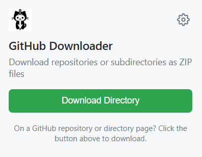

# GitHub Repository Downloader

A Chrome extension that lets you download GitHub repositories or specific subdirectories as ZIP files directly from the GitHub interface.

## Features

- **Integrated Download Button**: A green download button is added directly to the GitHub interface
- **Directory Support**: Download specific subdirectories without having to clone the entire repository
- **Recursive Downloads**: Automatically includes all subdirectories and their files in the download
- **Progress Tracking**: Detailed progress information as files are downloaded and the ZIP is created
- **Modern & Legacy UI Support**: Works with both the latest GitHub interface and older versions
- **Fallback Methods**: Multiple download techniques ensure files are retrieved even if the primary method fails
- **Error Recovery**: Continues downloading even if individual files fail

## Installation

### From the Chrome Web Store

1. Visit the [GitHub Repository Downloader](https://chrome.google.com/webstore/detail/github-repository-downloa/extension-id) page in the Chrome Web Store
2. Click "Add to Chrome" to install the extension
3. The extension icon will appear in your browser toolbar

### Manual Installation (Developer Mode)

1. Clone or download this repository
2. Open Chrome and navigate to `chrome://extensions/`
3. Enable "Developer mode" (toggle in the top-right corner)
4. Click "Load unpacked" and select the extension directory
5. The extension icon should now appear in your browser toolbar

## Usage

### Option 1: Using the Integrated Download Button

1. Navigate to any GitHub repository or subdirectory
2. Look for the green "Download Repository" or "Download Directory" button in the GitHub navigation bar
3. Click the button to start the download
4. A progress indicator will appear in the extension popup
5. The ZIP file will be downloaded automatically when complete

### Option 2: Using the Extension Icon

1. Navigate to any GitHub repository or subdirectory
2. Click the extension icon in your browser toolbar
3. Click the "Download Repository" button in the popup
4. The download will begin and show progress in the popup
5. The ZIP file will be downloaded automatically when complete

## How It Works

- For full repositories: Uses GitHub's API and raw content URLs to gather files
- For subdirectories: 
  - Analyzes the page to find all files and subdirectories
  - Recursively traverses all subdirectories
  - Downloads each file individually
  - Packages everything into a ZIP file with the correct directory structure
- The extension intelligently handles different GitHub UI versions and adapts its file detection methods accordingly

## Technical Details

- Built with vanilla JavaScript
- Uses the JSZip library for ZIP file creation
- Implements multiple fallback strategies for reliable downloads
- Uses GitHub's API when possible for better performance
- Falls back to HTML parsing when the API is unavailable
- Supports modern and legacy GitHub interfaces

## Requirements

- Chrome browser (version 88+)
- Internet connection
- Access to GitHub.com

## Troubleshooting

- **Download fails with no files**: Make sure you have access to the repository (private repositories require login)
- **Missing files**: Try refreshing the page before downloading
- **API rate limits**: If you encounter GitHub API rate limits, wait a few minutes and try again

## Privacy

This extension:
- Does not collect any personal data
- Does not track your browsing activity
- Only requests permissions necessary for its functionality
- Only activates on GitHub.com domains

## Credits

- [JSZip](https://stuk.github.io/jszip/) for ZIP file creation
- Icon designed by [Freepik](https://www.freepik.com/)

## License

MIT License - See LICENSE file for details

## Contributing

Contributions are welcome! Please feel free to submit a Pull Request.

