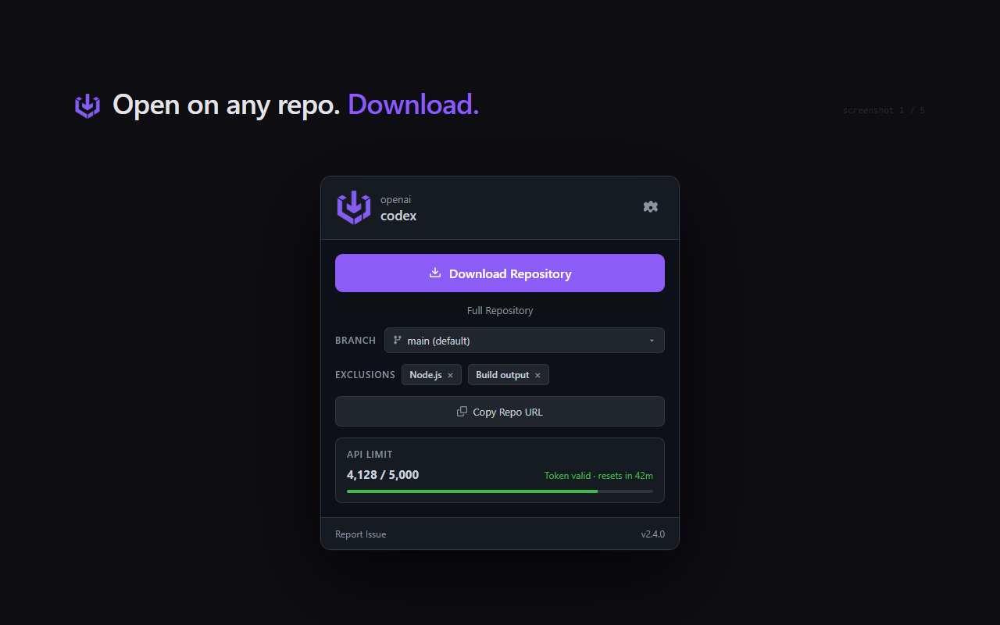
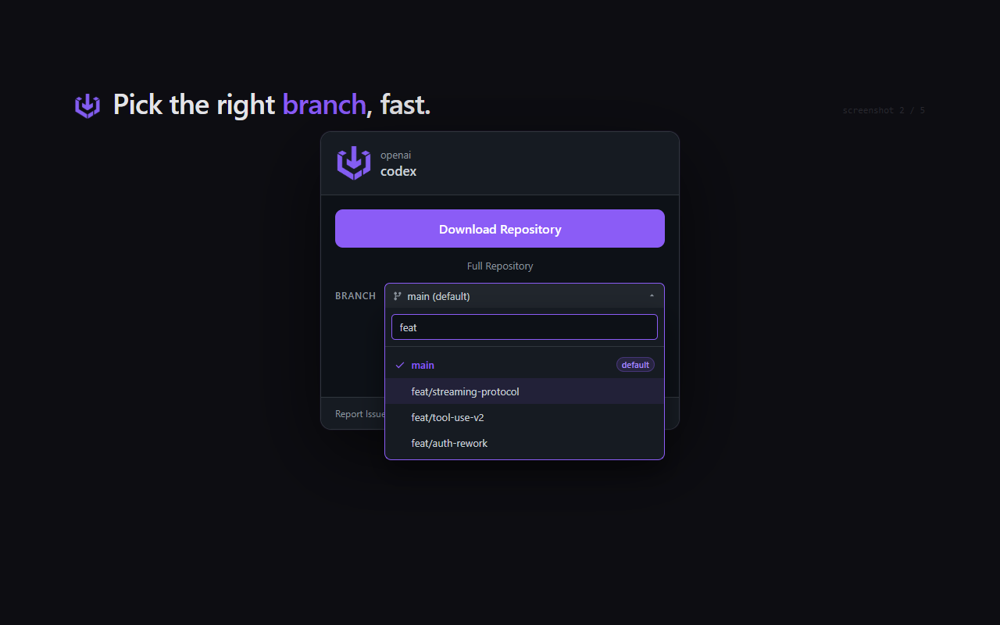
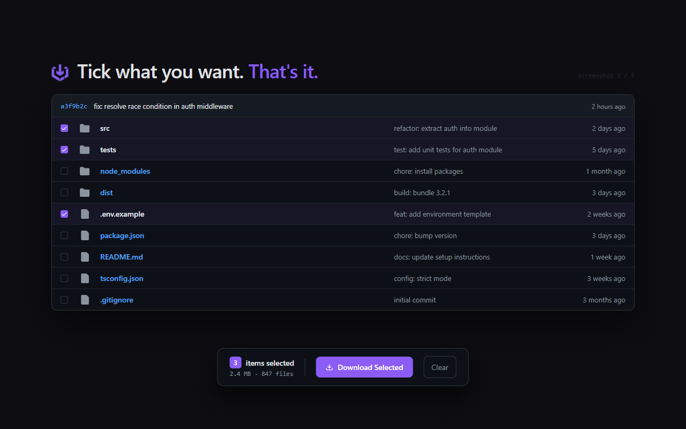
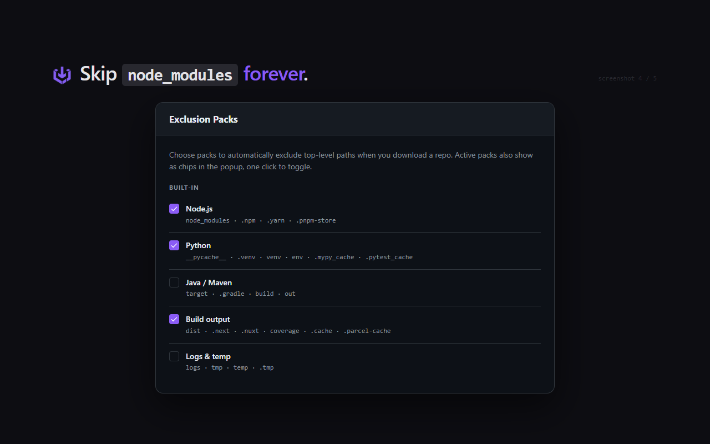
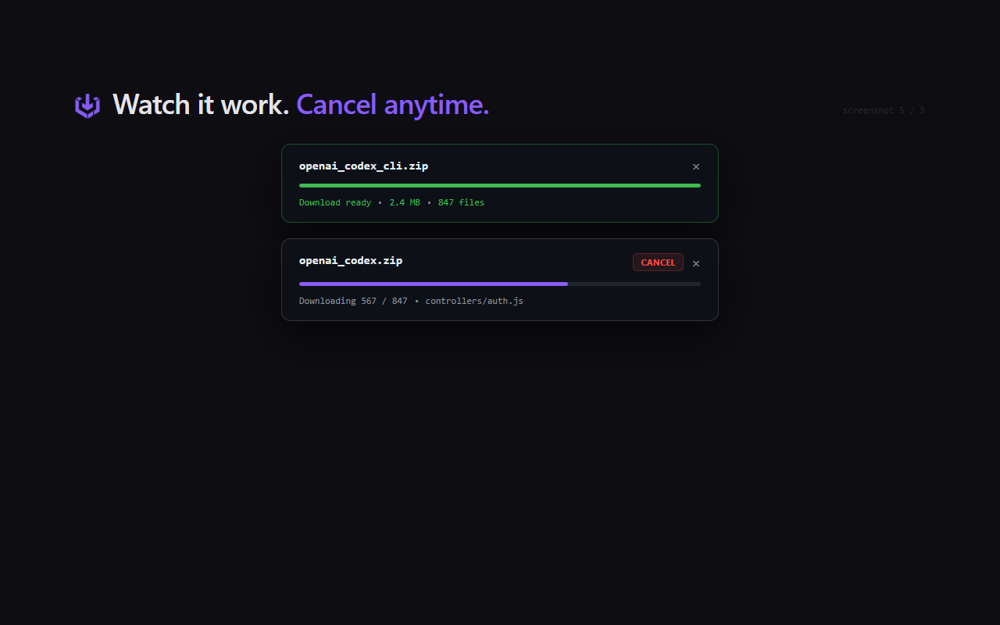
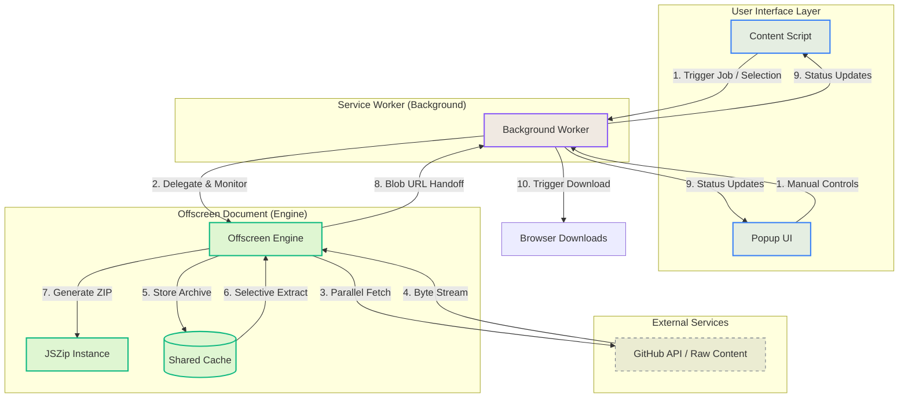

  

  # GitHub Smart Downloader

  **GitHub Smart Downloader** is a Manifest V3 Chrome extension for downloading GitHub repositories, folders, or selected files as ZIP archives directly from the browser. It supports full repository downloads, folder-level downloads, selected file/folder packaging, GitHub token-based API access, and progress tracking.

  

    
    
  

---

## 📸 Visual Showcase

  <table>
    <tr>
      <td width="50%">
        
<strong>Open on any repo</strong>

        
      </td>
      <td width="50%">
        
<strong>Find the right branch fast</strong>

        
      </td>
    </tr>
    <tr>
      <td width="50%">
        
<strong>Tick what you want</strong>

        
      </td>
      <td width="50%">
        
<strong>Skip node_modules forever</strong>

        
      </td>
    </tr>
    <tr>
      <td colspan="2">
        
<strong>Watch it work, cancel anytime</strong>

        
      </td>
    </tr>
  </table>

---

## ✨ Key Features

- **Granular Selection**: Download individual files, specific directories, or entire repositories.
- **Branch Picker**: Pick any branch from the popup with live search, paginated up to 1,000 branches; default branch is always pinned to the top.
- **Exclusion Packs**: Toggle preset path filters (Node.js, Python, Java/Maven, Build output, Logs) or define your own; active packs apply to full-repo downloads as removable chips in the popup.
- **Offscreen Processing**: Utilizes a dedicated Manifest V3 offscreen document for ZIP generation and background operations.
- **Shared Archive Cache**: Reuses repository archives across concurrent jobs to reduce duplicate API calls and network overhead.
- **Selective ZIP Extraction**: Packages selected files or folders from cached repository data without re-scanning the GitHub API.
- **Real-time Monitoring**: Track progress for multiple concurrent jobs through a clean, native-feeling dashboard.
- **Theme Support**: Fully compatible with GitHub's Light and Dark modes with customizable accent colors.
- **Rate Limit Management**: Built-in support for Personal Access Tokens (PAT) to handle large repository structures.

---

## 🏗️ Architecture

GitHub Smart Downloader uses a multi-context architecture to maximize performance and ensure stability within the constraints of Manifest V3.

```mermaid
flowchart TD
    subgraph UI ["User Interface Layer"]
        CS[Content Script]
        P[Popup UI]
    end

    subgraph SW ["Service Worker (Background)"]
        BW[Background Worker]
    end

    subgraph OS ["Offscreen Document (Engine)"]
        OE[Offscreen Engine]
        JSZ[JSZip Instance]
        CACHE[(Shared Cache)]
    end

    subgraph EXT ["External Services"]
        GH[GitHub API / Raw Content]
    end

    %% UI to Service Worker
    CS -- "1. Trigger Job / Selection" --> BW
    P -- "1. Manual Controls" --> BW

    %% Service Worker to Offscreen
    BW -- "2. Delegate & Monitor" --> OE

    %% Offscreen Engine Internal
    OE -- "3. Parallel Fetch" --> GH
    GH -- "4. Byte Stream" --> OE
    OE -- "5. Store Archive" --> CACHE
    CACHE -- "6. Selective Extract" --> OE
    OE -- "7. Generate ZIP" --> JSZ

    %% Handoff
    OE -- "8. Blob URL Handoff" --> BW
    BW -- "9. Status Updates" --> CS
    BW -- "9. Status Updates" --> P
    BW -- "10. Trigger Download" --> D[Browser Downloads]

    %% Styling
    classDef ui fill:#3b82f622,stroke:#3b82f6,stroke-width:2px;
    classDef sw fill:#8b5cf622,stroke:#8b5cf6,stroke-width:2px;
    classDef os fill:#10b98122,stroke:#10b981,stroke-width:2px;
    classDef ext fill:#6b728022,stroke:#6b7280,stroke-dasharray: 5 5;
    
    class CS,P ui;
    class BW sw;
    class OE,JSZ,CACHE os;
    class GH ext;
```

---

## 🛠️ Installation & Setup

### Recommended: Chrome Web Store

Install the published extension directly from the Chrome Web Store:

  

After installation, open any GitHub repository and use the injected download controls near the repository toolbar, folder rows, and file rows. For larger repositories or frequent downloads, add a GitHub Personal Access Token in the extension settings to raise the GitHub API rate limit from 60 requests per hour to 5,000 requests per hour.

<b>Developer Installation (Unpacked)</b>

1.  **Clone this repository**: `git clone https://github.com/sserdardundar/GitHub-Smart-Downloader.git`
2.  **Open Chrome Extensions**: Navigate to `chrome://extensions/`.
3.  **Enable Developer Mode**: Toggle the switch in the top right.
4.  **Load Unpacked**: Click "Load unpacked" and select the root directory of this project.

<b>Developer Guide</b>

For detailed development setup and architectural details, please refer to the **[Usage Guide](docs/USAGE.md)** and **[Architecture Overview](docs/ARCHITECTURE.md)**.

---

## ⚠️ Limitations

- **Memory Limits**: Extremely large repositories may exceed browser memory limits during ZIP generation.
- **Rate Limits**: GitHub API rate limits apply (60/hr without a token, 5,000/hr with a token).
- **Private Repositories**: Accessing private repositories requires a GitHub Personal Access Token with read access to the target repository.
- **DOM Dependencies**: Significant changes to the GitHub UI may require extension updates.

---

## 🔒 Security & Privacy

- **Encrypted Storage**: GitHub Personal Access Tokens are encrypted before being stored in Chrome extension storage. The extension does not send tokens to any third-party backend.
- **Local-Only Processing**: Your tokens and downloaded data are processed exclusively within your browser; no data is sent to external servers other than official GitHub endpoints.
- **Secure Communication**: All API interactions are performed via official HTTPS GitHub endpoints.

---

  Licensed under the MIT License. Built with 🔨⚙️ by <a href="https://github.com/sserdardundar">sserdardundar</a>.
   
  GitHub Smart Downloader is not affiliated with, maintained, authorized, endorsed, or sponsored by GitHub or its affiliates.

