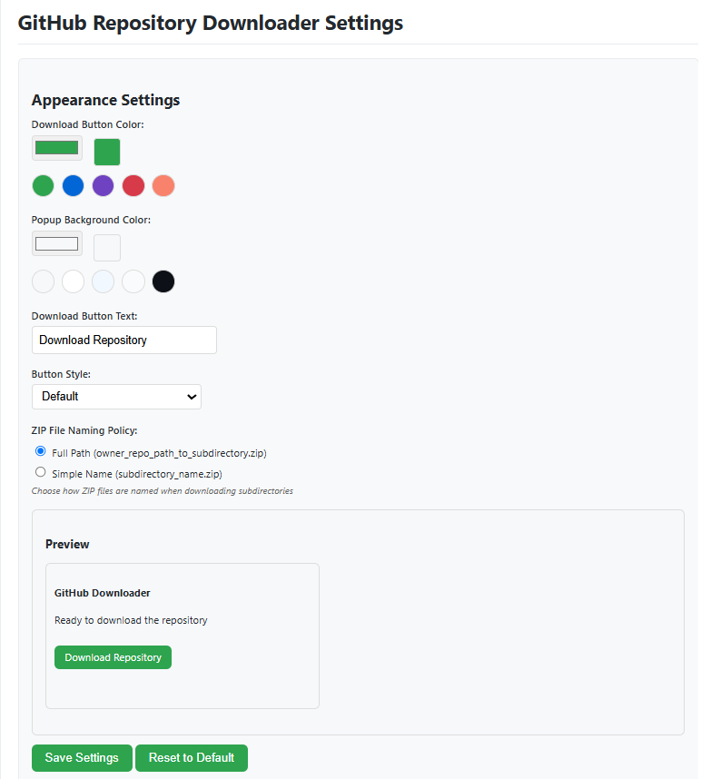

# GitHub Repository Downloader

A Chrome extension that lets you download GitHub repositories or specific subdirectories as ZIP files directly from the GitHub interface.

## Features

- **Integrated Download Button**: A download button is added directly to the GitHub interface
- **Directory Support**: Download specific subdirectories without having to clone the entire repository
- **Recursive Downloads**: Automatically includes all subdirectories and their files in the download
- **Progress Tracking**: Detailed progress information as files are downloaded and the ZIP is created
- **User-Friendly Notifications**: Status notifications with progress bars that auto-dismiss when complete
- **Robust Error Handling**: Multiple retry attempts with exponential backoff for failed downloads
- **CSP-Compliant**: Properly handles Content Security Policy restrictions with multiple loading methods
- **Modern & Legacy UI Support**: Works with both the latest GitHub interface and older versions
- **Fallback Methods**: Multiple download techniques ensure files are retrieved even if the primary method fails
- **Error Recovery**: Continues downloading even if individual files fail
- **Customization Options**: Personalize the extension's appearance with custom colors and button styles
- **Optimized Downloads**: Uses a high-performance approach to quickly download subdirectories

## Installation

### From the Chrome Web Store (!!SOON)

1. Visit the [GitHub Repository Downloader](https://chrome.google.com/webstore/detail/github-repository-downloa/extension-id) page in the Chrome Web Store
2. Click "Add to Chrome" to install the extension
3. The extension icon will appear in your browser toolbar

### Manual Installation (Developer Mode)

1. Clone or download this repository
2. Open Chrome and navigate to `chrome://extensions/`
3. Enable "Developer mode" (toggle in the top-right corner)
4. Click "Load unpacked" and select the extension directory
5. The extension icon should now appear in your browser toolbar

## Usage

### Option 1: Using the Integrated Download Button

1. Navigate to any GitHub repository or subdirectory
2. Look for the "Download Repository" or "Download Directory" button in the GitHub navigation bar
3. Click the button to start the download
4. A progress indicator will appear showing the download status
5. The ZIP file will be downloaded automatically when complete

### Option 2: Using the Extension Icon

1. Navigate to any GitHub repository or subdirectory
2. Click the extension icon in your browser toolbar
3. Click the "Download Repository" button in the popup
4. The download will begin and show progress in the popup
5. The ZIP file will be downloaded automatically when complete

### Downloading Subdirectories

The extension provides efficient ways to download specific subdirectories:

1. Navigate to the specific subdirectory within a GitHub repository
2. The download button will change to "Download Directory"
3. Click the button to download only that subdirectory and its contents
4. The extension processes the subdirectory and creates a ZIP containing only those files
5. The ZIP file will have the subdirectory as the root, with the correct folder structure

This is especially useful for large repositories where you only need a small section. The extension uses concurrent downloads to speed up this process, efficiently handling many files at once.

## Optimization Techniques

This extension uses two methods for downloading GitHub repositories:

### 1. Direct Repository Download
- Uses GitHub's native download functionality for complete repositories
- Bypasses CORS restrictions by using Chrome's download API
- Downloads the entire repository as a ZIP file
- This is the fastest method for full repository downloads

### 2. Concurrent File Processing (for Subdirectories)
- Downloads files in parallel using multiple concurrent connections
- Features intelligent retry logic with exponential backoff for failed downloads
- Automatically adjusts concurrency based on failure rates to prevent GitHub API throttling
- Creates a custom ZIP with just the content you requested, preserving folder structure
- Shows real-time progress with auto-dismissing notifications
- Intelligently processes directories recursively with proper path handling
- Uses a chunking strategy to balance speed and reliability
- Supports configurable file naming policies (full path or simple name)

The extension automatically chooses the best method based on what you're trying to download. For full repositories, it uses the direct method; for subdirectories, it uses concurrent processing to download just the files you need.

## Customization

You can personalize the appearance of the extension through the settings page:

1. Right-click on the extension icon in your browser toolbar
2. Select "Options" to open the settings page
3. Customize the following:
   - **Download Button Color**: Choose any color for the download button
   - **Popup Background Color**: Customize the background color of the popup
   - **Button Text**: Change the text displayed on the download button
   - **Button Style**: Choose from different button styles (Default, Outline, Rounded, Pill)
   - **ZIP File Naming Policy**: Select how subdirectory ZIP files are named:
     - **Full Path**: More descriptive names with repository and full path (e.g., `owner_repo_path_to_subdirectory.zip`)
     - **Simple Name**: Just use the subdirectory name (e.g., `subdirectory_name.zip`)
4. Click "Save Settings" to apply your changes

## How It Works

- **Repository Root Downloads**: 
  - Uses GitHub's native download functionality when available
  - Falls back to API and raw content URLs when needed
  
- **Subdirectory Downloads**: 
  - Analyzes the directory structure using GitHub's API
  - Recursively traverses all subdirectories
  - Downloads each file individually with automatic retries
  - Preserves the correct directory structure
  - Packages everything into a ZIP file with the subdirectory as the root
  
- **Multiple Download Methods**:
  - Direct download via createObjectURL and download attribute
  - Chrome Download API for reliable downloading
  - Dedicated download page for handling larger files
  - Individual file downloading with retry mechanism

- **Reliable Networking**:
  - Smart retry logic with exponential backoff for failed requests
  - Timeout management to prevent hanging downloads
  - Reduced concurrency on retries to avoid API rate limits
  - Auto-dismissing notifications with progress information

- **CSP-Compliant Architecture**:
  - Uses Chrome's scripting API to properly inject the JSZip library
  - Multiple fallback mechanisms for script loading
  - Background service worker handles secure script injection

## Technical Details

- Built with vanilla JavaScript
- Uses the JSZip library for ZIP file creation
- Implements multiple fallback strategies for reliable downloads
- Chrome's Scripting API for CSP-compliant code execution
- Uses GitHub's API when possible for better performance
- Falls back to HTML parsing when the API is unavailable
- Supports modern and legacy GitHub interfaces

## Requirements

- Chrome browser (version 88+)
- Internet connection
- Access to GitHub.com

## Troubleshooting

- **Content Security Policy errors**: The extension has multiple fallback methods for script injection
- **Download fails with no files**: Make sure you have access to the repository (private repositories require login)
- **Missing files**: The extension will automatically retry failed downloads, but some files may still be missing if they can't be accessed
- **API rate limits**: The extension automatically reduces concurrent downloads when rate limits are detected
- **Large repositories**: For very large repositories, consider downloading specific subdirectories instead of the entire repository
- **Network issues**: The extension includes timeout handling and will retry downloads that fail due to network issues

## Privacy

This extension:
- Does not collect any personal data
- Does not track your browsing activity
- Only requests permissions necessary for its functionality
- Only activates on GitHub.com domains

## Credits

- [JSZip](https://stuk.github.io/jszip/) for ZIP file creation
- [FileSaver.js](https://github.com/eligrey/FileSaver.js) for enhanced download capabilities

## License

MIT License - See LICENSE file for details

## Contributing

Contributions are welcome! Please feel free to submit a Pull Request.

